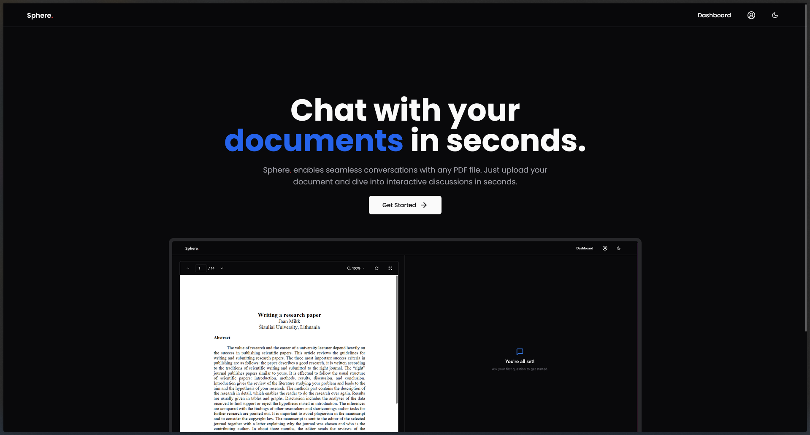

# Sphere: AI-Powered PDF Interaction Web App 🚀

Sphere is a web application that leverages the power of AI to enable seamless interaction with PDF documents. Built with Next.js, TRPC, and Langchain, Sphere offers a user-friendly interface for extracting insights, answering questions, and summarizing information from your PDFs.

## ✨ Key Features

*   **AI-Powered PDF Interaction:** Utilize the power of AI to understand and interact with your PDF documents.
*   **Question Answering:** Ask questions about the content of your PDFs and receive accurate answers.
*   **Summarization:** Generate concise summaries of lengthy PDF documents.
*   **Next.js Frontend:** Enjoy a fast and responsive user experience with a modern React-based frontend.
*   **TRPC API:** Benefit from type-safe API interactions between the frontend and backend.
*   **Langchain Integration:** Harness the capabilities of Langchain for advanced language processing tasks.
*   **Supabase Authentication:** Secure user authentication with Supabase.

## 🖼️ Screenshots

Here are some screenshots of the Sphere application:

**Homepage:**

**PDF Upload and Processing:**

**Question Answering Interface:**

